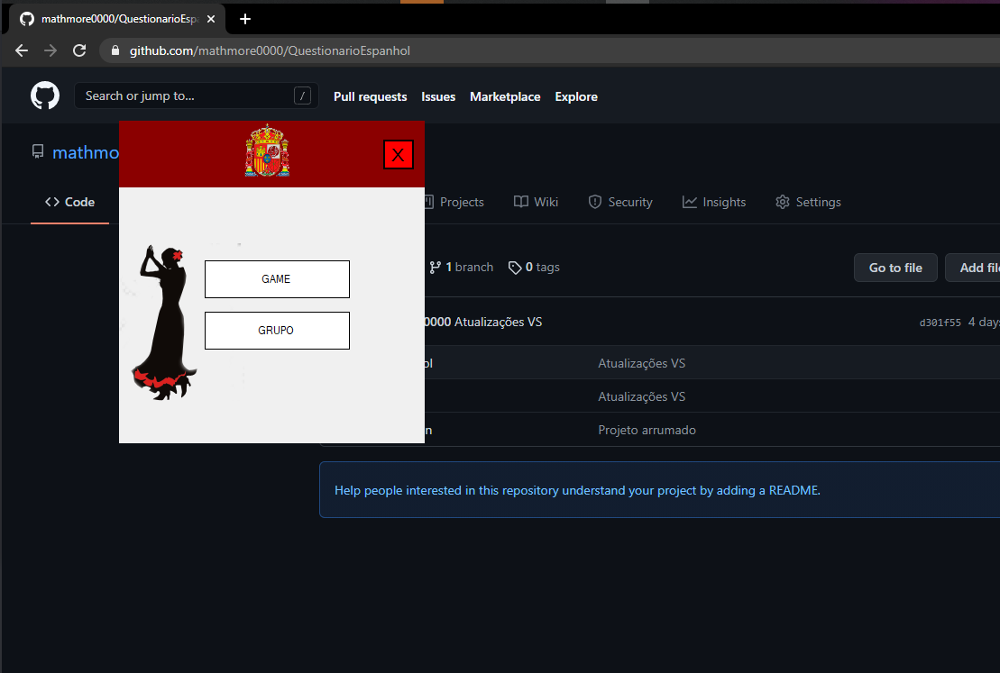
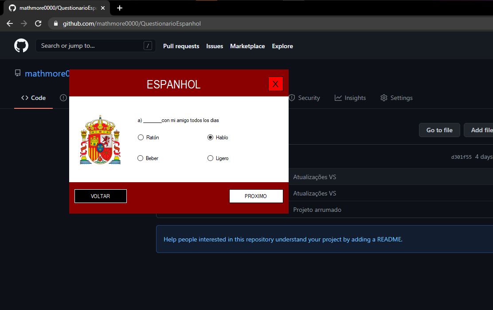
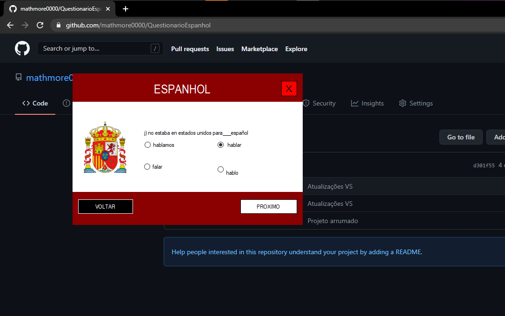
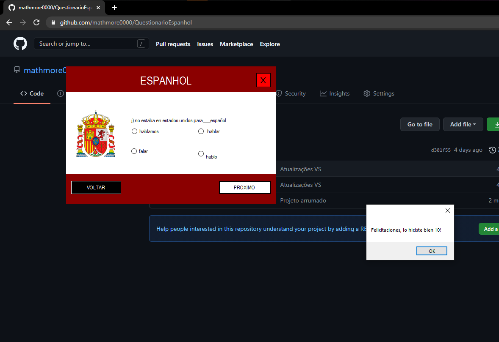

# QuestionarioEspanhol
<h3> Questionário de espanhol puxando perguntas e respostas com jsons deixando a adição ou remoção de perguntas muito fácil. </h3>

Usuário abre o software 
  
Usuário começa o questionário 
  
Usuário finaliza o questionário  
  
E recebe a nota final!  
  
